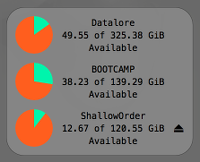

MountedVolumes
==============

Displays a list of mounted volumes and a pie chart for each indicating free space on the desktop.

Download: `svn export https://github.com/asmagill/hammerspoon-config/trunk/_Spoons/MountedVolumes.spoon`

### Usage
~~~lua
MountedVolumes = hs.loadSpoon("MountedVolumes")
~~~

### Contents

##### Module Methods
* <a href="#bindHotkeys">MountedVolumes:bindHotkeys(mapping)</a>
* <a href="#hide">MountedVolumes:hide()</a>
* <a href="#show">MountedVolumes:show()</a>

##### Module Variables
* <a href="#backgroundBorder">MountedVolumes.backgroundBorder</a>
* <a href="#backgroundColor">MountedVolumes.backgroundColor</a>
* <a href="#capacityColor">MountedVolumes.capacityColor</a>
* <a href="#checkInterval">MountedVolumes.checkInterval</a>
* <a href="#cornerRadius">MountedVolumes.cornerRadius</a>
* <a href="#enableEjectButton">MountedVolumes.enableEjectButton</a>
* <a href="#freeColor">MountedVolumes.freeColor</a>
* <a href="#growsDownwards">MountedVolumes.growsDownwards</a>
* <a href="#location">MountedVolumes.location</a>
* <a href="#logger">MountedVolumes.logger</a>
* <a href="#textStyle">MountedVolumes.textStyle</a>
* <a href="#unitsInSI">MountedVolumes.unitsInSI</a>

- - -

### Module Methods

~~~lua
MountedVolumes:bindHotkeys(mapping)
~~~
Binds hotkeys for MountedVolumes

Parameters:
 * `mapping` - A table containing hotkey modifier/key details for one or more of the following commands:
   * "show"   - Show the volume list
   * "hide"   - Hide the volume list
   * "toggle" - If the volume list is visible then hide it; otherwise show the list.

Returns:
 * None

Notes:
 * the `mapping` table is a table of one or more key-value pairs of the format `command = { { modifiers }, key }` where:
   * `command`   - is one of the commands listed above
   * `modifiers` - is a table containing keyboard modifiers, as specified in `hs.hotkey.bind()`
   * `key`       - is a string containing the name of a keyboard key, as specified in `hs.hotkey.bind()`

- - -

~~~lua
MountedVolumes:hide()
~~~
Hide the volumes panel on the background and stop watching for volume changes

Parameters:
 * None

Returns:
 * The MountedVolumes object

- - -

~~~lua
MountedVolumes:show()
~~~
Display the volumes panel on the background and update it as volumes are mounted and unmounted.

Parameters:
 * None

Returns:
 * The MountedVolumes object

Notes:
 * If you make a change to any of the variables defining the visual appearance of the volume list, you can force the change to take immediate effect by invoking this method, even if the volume list is already being displayed.

### Module Variables

~~~lua
MountedVolumes.backgroundBorder
~~~
A table, as defined in `hs.drawing.color`, specifying the color of the volume lists border. Defaults to `{ alpha = .5 }`

Changes will take effect when the next volume change occurs, when the next usage check occurs (see `MountedVolumes.checkInterval`), or when `MountedVolumes:show` is invoked, whichever occurs first.

- - -

~~~lua
MountedVolumes.backgroundColor
~~~
A table, as defined in `hs.drawing.color`, specifying the color of the volume lists background. Defaults to `{ alpha = .7, white = .5 }`

Changes will take effect when the next volume change occurs, when the next usage check occurs (see `MountedVolumes.checkInterval`), or when `MountedVolumes:show` is invoked, whichever occurs first.

- - -

~~~lua
MountedVolumes.capacityColor
~~~
A table, as defined in `hs.drawing.color`, specifying the color to use for the in use portion of the volume's capacity pie chart. Defaults to `hs.drawing.color.x11.orangered`

Changes will take effect when the next volume change occurs, when the next usage check occurs (see `MountedVolumes.checkInterval`), or when `MountedVolumes:show` is invoked, whichever occurs first.

- - -

~~~lua
MountedVolumes.checkInterval
~~~
A number, default 120, specifying how often in seconds the free space on mounted volumes should be polled for current usage data.

Changes will take effect when the next volume change occurs, when the next usage check occurs (see `MountedVolumes.checkInterval`), or when `MountedVolumes:show` is invoked, whichever occurs first.

- - -

~~~lua
MountedVolumes.cornerRadius
~~~
A number, default 5, specifying how rounded the corners of the volume list background should be.

Changes will take effect when the next volume change occurs, when the next usage check occurs (see `MountedVolumes.checkInterval`), or when `MountedVolumes:show` is invoked, whichever occurs first.

- - -

~~~lua
MountedVolumes.enableEjectButton
~~~
A boolean, default true, indicating whether the eject button displayed next to removable volumes is enabled.

Changes will take effect when the next volume change occurs, when the next usage check occurs (see `MountedVolumes.checkInterval`), or when `MountedVolumes:show` is invoked, whichever occurs first.

- - -

~~~lua
MountedVolumes.freeColor
~~~
A table, as defined in `hs.drawing.color`, specifying the color to use for the free portion of the volume's capacity pie chart. Defaults to `hs.drawing.color.x11.mediumspringgreen`

Changes will take effect when the next volume change occurs, when the next usage check occurs (see `MountedVolumes.checkInterval`), or when `MountedVolumes:show` is invoked, whichever occurs first.

- - -

~~~lua
MountedVolumes.growsDownwards
~~~
A boolean, default true, indicating whether the displayed list grows downwards or upwards as more volumes are mounted.
Note that if this value is true, then `MountedVolumes.location` specifies the upper left corner of the display.  If this value is false, then `MountedVolumes.location` specifies the bottom left corner of the display.

Changes will take effect when the next volume change occurs, when the next usage check occurs (see `MountedVolumes.checkInterval`), or when `MountedVolumes:show` is invoked, whichever occurs first.

- - -

~~~lua
MountedVolumes.location
~~~
A table specifying the location on the screen of the starting corner of the display. Defaults to `{ x = 20, y = 22 }`.
See also `MountedValues.growsDownwards`.

Changes will take effect when the next volume change occurs, when the next usage check occurs (see `MountedVolumes.checkInterval`), or when `MountedVolumes:show` is invoked, whichever occurs first.

- - -

~~~lua
MountedVolumes.textStyle
~~~
A table specifying the style as defined in `hs.styledtext` to display the volume name and usage details with. Defaults to:

    {
        font = { name = "Menlo", size = 10 },
        color = { alpha = 1.0 },
        paragraphStyle = { alignment = "center" },
    }

Changes will take effect when the next volume change occurs, when the next usage check occurs (see `MountedVolumes.checkInterval`), or when `MountedVolumes:show` is invoked, whichever occurs first.

- - -

~~~lua
MountedVolumes.unitsInSI
~~~
Boolean, default false, indicating whether capacity is displayed in SI units (1 GB = 10^9 bytes) or Gibibytes (1 GiB = 2^30 bytes).

Changes will take effect when the next volume change occurs, when the next usage check occurs (see `MountedVolumes.checkInterval`), or when `MountedVolumes:show` is invoked, whichever occurs first.

- - -

### License

>     The MIT License (MIT)
>
> Copyright (c) 2017 Aaron Magill
>
> Permission is hereby granted, free of charge, to any person obtaining a copy of this software and associated documentation files (the "Software"), to deal in the Software without restriction, including without limitation the rights to use, copy, modify, merge, publish, distribute, sublicense, and/or sell copies of the Software, and to permit persons to whom the Software is furnished to do so, subject to the following conditions:
>
> The above copyright notice and this permission notice shall be included in all copies or substantial portions of the Software.
>
> THE SOFTWARE IS PROVIDED "AS IS", WITHOUT WARRANTY OF ANY KIND, EXPRESS OR IMPLIED, INCLUDING BUT NOT LIMITED TO THE WARRANTIES OF MERCHANTABILITY, FITNESS FOR A PARTICULAR PURPOSE AND NONINFRINGEMENT. IN NO EVENT SHALL THE AUTHORS OR COPYRIGHT HOLDERS BE LIABLE FOR ANY CLAIM, DAMAGES OR OTHER LIABILITY, WHETHER IN AN ACTION OF CONTRACT, TORT OR OTHERWISE, ARISING FROM, OUT OF OR IN CONNECTION WITH THE SOFTWARE OR THE USE OR OTHER DEALINGS IN THE SOFTWARE.
>

